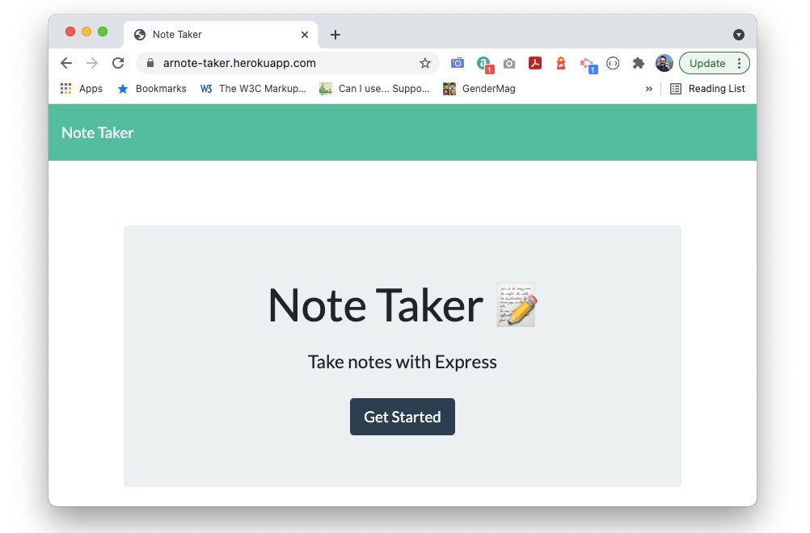

# 10 An Express Note Taker
[](https://www.gnu.org/licenses/gpl-3.0)

## Description
This is a an app that can be used to write and save notes. This application uses Express.js back end and saves / retrieves data from a JSON file.

## Table of Contents
* [Installation](#Installation)
* [Usage](#Usage)
* [Code](#Code)
* [License](#License)
* [Test instructions](#Test-Instructions)
* [Questions](#Questions)

## Installation
This app uses [EXPRESS](https://www.npmjs.com/package/express), [FS](https://nodejs.org/api/fs.html), and [PATH](https://nodejs.org/api/path.html). 

For this specific app, we'll only install the three mentioned above:

```
npm install express
```

```
npm install fs
```

```
npm install path
```

Optionally, it is possibl to install all NPM modules:

```
npm install 
```

## Usage
The application has been compiled and renders via Heroku at: https://arnote-taker.herokuapp.com/notes

Click on the link above and add, edit, and delete notes as needed. The UI is very straight-forward, but I've made a few modificaitons for ease of use:

* When users add a new note, the "Edit" button disappears. 
* The save button shows up on Title text, not just on body (I'm letting my users save notes with just a title).
* Notes without a title are simply not saved.
* The Edit button only shows when a note is active on the right pane.

Watch the app in action here:
[](https://arnote-taker.herokuapp.com/)

## Code

The code is modularized in middleware route Vs. server methods:

### Routes
There are two kinds of Express routers: API and HTML. The former is used to retrieve and store data (the notes) from the db.json file; while the latter is used to land the users into the /notes interface, which is where they can interact with the app.

* API Routes (noteRoutes):
    * /notes (GET) - Pulls all notes in the file
    ```
    router.get('/notes', (req, res) => {
        let results = notes;
        if (req.query) {
            results = filterByQuery(req.query, results);
        }
        res.json(results);
    });
    ```
    * /notes (POST) - Saves notes
        The note ID creation is handled here by getting the maximum existing ID and adding +1.

    ```
    router.post('/notes', (req, res) => {        
        if (!req.body.id) {
            if (notes.length) {
                req.body.id = Math.max.apply(Math, notes.map( function(noteObject) {
                    return noteObject.id + 1;
                }));
            } else {
                req.body.id = 1;
            }
        } 
        
        if (!validateNote(req.body)) {
            res.status(400).send('The note is missing a title');
        } else {
            notes = createNewNote(req.body, notes);
            res.json(notes);
        }
    });
    ```

    * /notes/:id (DELETE) - Deletes the note identified by ID
    ```
    router.delete('/notes/:id', (req, res) => {
        notes = deleteNote(req.params.id, notes);
        res.json(notes);
    });

The actual methods to retrieve, save, and delete can be found on /lib/notes.js.

* HTML Routes (htmlRoutes)

    * / (GET) and * (GET) - Route users back to the home page:
    ```
    // Routes user to index.html when they land on the root '/'
    router.get('/', (req, res) => {
        res.sendFile(path.join(__dirname, '../../public/index.html'));
    });

    // Anything else - get back to index
    router.get('*', (req, res) => {
        res.sendFile(path.join(__dirname, '../../public/index.html'));
    });
    ```

    * /notes (GET) - Routes users to the note-taking page
    ```
    // Renders note.html when users land on /notes
    router.get('/notes', (req, res) => {
        res.sendFile(path.join(__dirname, '../../public/notes.html'));
    });
    ```
The JS methods to control the interface can be found on /public/assets/js. A few modifications from the original base code were made for usability purposes.

## Questions
E-mail me: <lou.arnaut@gmail.com>
Checkout my Github profile: [acevezl](https://github.com/acevezl)
